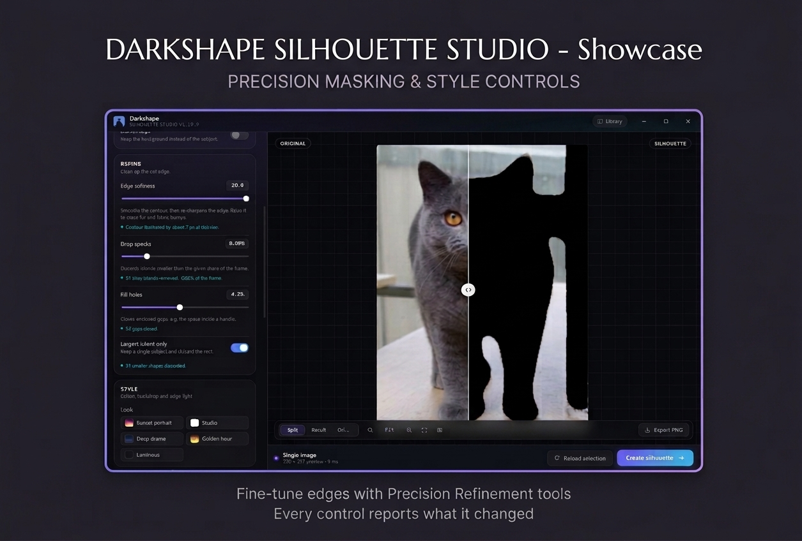

# Darkshape — Silhouette Studio

An [Eagle](https://eagle.cool) plugin that turns photographs into clean, solid
silhouettes. Work on a single photo with a live preview, or select a whole
folder's worth of images and convert them in one batch.



---

## Features

Pick a subject out of any photo and render it as a pure shape — solid black on
transparency by default, or any colour on any background. The result is a new
image in your Eagle library, so it inherits tags, folders and search like any
other asset.

- **Single mode** — select one image, tune it with instant feedback.
- **Batch mode** — select many images, one settings pass, everything converted.
- **Auto-tune per image** — the plugin reads each photo's backdrop and shape
  and chooses the detection method, the stray-object rule and the gap filling
  for it. A batch does not have to share one recipe.
- **Four detection modes** — automatic, background modelling, contrast
  thresholding, or the file's own alpha channel.
- **Generated backdrops** — vibrant sunset, studio white, deep gradient and
  golden hour, painted procedurally at any resolution. No assets, no network.
- **Rim light** — a backlit halo hugging the profile, aimed from any of eight
  directions or evenly all round.
- **Luminous shape** — renders the subject as a glowing form rather than a flat
  cutout, keeping soft wisps and internal brightness through a feathered edge.
- **One-click looks** — Sunset portrait, Studio, Deep drama, Golden hour and
  Luminous set the backdrop, edge light and crispness together.
- **Live split comparison** — drag the divider to compare the original and the
  silhouette at the same crop.
- **Tells you when it cannot help** — photos whose subject and backdrop share a
  tone are reported rather than guessed at, and a whole queue is checked before
  the run starts.
- **Non-destructive** — originals are never modified; results are added as new
  items.
- **Fully offline** — no network access, no telemetry, no external binaries,
  no dependencies.

---

## Screenshots

**The window.** Original and silhouette side by side on a draggable split, with
the detection and refinement controls to the left.


**Detection.** Four methods, with the brightness split shown as the level it
actually resolved to rather than just the word "Auto".


**Refinement.** Every control reports what it actually did on the current image,
so a control with nothing to do does not look broken.


**Looks and shapes.** Five one-click recipes, three shape styles and a row of
silhouette colours.


**Scene backdrops.** Four generated backdrops, painted procedurally at any
output size rather than loaded as images.


**Rim light.** A backlit halo hugging the profile, aimed from any of eight
directions or evenly all round.


**Luminous.** For images that already carry their own light — long-exposure
water, smoke, fireworks, backlit haze.


**Output.** Where the results go, what they are called, and what they are
tagged with.


---

## Requirements

- **Eagle 4.x** (eagle.cool), on Windows or macOS.
- **Nothing else.** No Node.js, no Python, no ImageMagick, no external
  binaries, and no runtime dependencies — the plugin ships as four JavaScript
  files, a stylesheet and a manifest, and Eagle runs them directly.
- **No network connection** is used at any point.

The bundled `tools/install.ps1` is a PowerShell script and therefore
Windows-only. On macOS, install by hand — see below.

---

## Installation

### From the release — easiest

1. Download the latest **`darkshape-<version>.zip`** from
   [Releases](https://github.com/Stef4678/darkshape/releases/latest).
2. Extract the `darkshape-silhouette-studio` folder from it into Eagle's plugin
   folder — see the table below.
3. Restart Eagle, so it rescans its plugin directory.

The plugin appears in Eagle's plugin list as **Darkshape**.

### From source

Eagle plugins are just a folder, so installation is a clone and a copy:

```
git clone https://github.com/Stef4678/darkshape.git
cd darkshape
pwsh -File tools/install.ps1
```

Or download the repository as a ZIP and run the same script from the unpacked
folder. The script copies only the runtime files into
`%APPDATA%\Eagle\Plugins\darkshape-silhouette-studio\`.

**Installing by hand** — on any platform, create a folder called
`darkshape-silhouette-studio` inside Eagle's plugin directory and copy these
into it:

```
manifest.json
logo.png
index.html
css/
js/
```

The plugin directory is:

| Platform | Plugin folder |
| --- | --- |
| Windows | `%APPDATA%\Eagle\Plugins\` |
| macOS | typically `~/Library/Application Support/Eagle/Plugins/` — see [Where are Eagle plugins installed?](https://en.eagle.cool/support/article/where-are-eagle-plugins-installed-on-my-computer) |

I have only been able to test the Windows path, so if the macOS folder is
somewhere else, Eagle's own article above is the authority.

`manifest.json` must sit at the top level of that folder, not inside a nested
one. The `tools/`, `tests/` and `assets/` folders are development files and are
not needed to run the plugin.

---

## Usage

1. Select one or more images in Eagle.
2. Open **Darkshape** from the plugin menu.
3. Pick a **Look** for an instant result, or adjust the controls yourself.
4. Press **Create silhouette** (or `Ctrl`/`Cmd` + `Enter`).

For a striking silhouette portrait specifically: choose the **Sunset portrait**
or **Deep drama** look, which give you a pitch-black subject, a generated sky
and a directional rim light in one click. Then fine-tune.

Results are added to the same folder as the original, tagged if you asked for
it, and selected in Eagle when the run finishes. Use **Export PNG** to also
write the files to a folder on disk — handy for print or stencil work.

Nothing selected? Drop image files straight onto the window, or use
**Browse files**.

### Auto-tune

**Auto-tune each image** is on by default. Every photo is read before it is
rendered, and these are set from what the measurement shows:

| Setting | Decided from |
| --- | --- |
| Detection method | If the file carries a meaningful alpha channel, that **is** the shape and nothing is thresholded. Otherwise each method is run and scored (see below). |
| Background vs Contrast | Scored against each other. Background modelling wins ties, because it uses colour *and* connectivity while a brightness split ignores what is joined to the frame. |
| Darker or lighter subject | The backdrop's own brightness: a light backdrop means a dark subject. |
| Largest island only | How the mask splits into objects. On when one object clearly dominates and the rest are small strays; off when two are comparable, which usually means a genuine second subject. |
| Fill holes | The size of the enclosed gaps actually present, with headroom. |

**A file that already has its shape is left alone.** An AI cut-out brought in
as a PNG is not re-thresholded, for two reasons. It would be redundant —
thresholding can only approximate what the file states exactly — and it is
actively harmful, because when the subject is cropped at the frame part of the
border ring is the subject itself, so the backdrop model gets built out of the
thing it is meant to remove. Measured on a cut-out whose subject runs off the
top and bottom edges, thresholding agreed with the file's own alpha at 0.49;
honouring the alpha agrees at 1.00.

Asking for **Alpha** on a file that has no transparency used to copy an
all-opaque channel into the mask and fill the entire frame with one solid
shape. It now models the backdrop instead, and says so under the Mode control.

**Methods are tried, not guessed.** Choosing between background modelling and
Contrast used to be a rule of thumb about how uneven the backdrop looked —
which is wrong for a backdrop that simply holds two *regions*, like a white
wall above a blue sofa. Both are now run and scored on two independent things:

- **Stability** — nudge the setting the method depends on and see whether the
  outline holds still. A boundary that jumps is following the threshold, not
  the picture.
- **Purity** — how much of what it found is made of the backdrop's own
  colours. A mask that selected the *backdrop* is one object with a perfectly
  stable boundary, so it passes every shape test there is; the only thing that
  gives it away is that it is painted in the backdrop's palette. On a grey cat
  peering over a blue sofa against a white wall, cutting on brightness scores
  0.31 — its "subject" is 69% sofa — while modelling the backdrop scores 0.99.

Neither alone is sufficient, so the winner is the product of the two.

It reports its reasoning under the switch, so the decision is never invisible.
Operating any of those four controls by hand switches auto-tune off and tells
you so — the alternative, leaving it on, would silently undo your change on
the next image.

**When nothing can be separated, it says so.** Before settling, the tuner
nudges the detection level a little and checks whether the outline holds still.
A boundary that jumps when the level shifts is not following anything in the
picture — it is just where the threshold happened to fall. On a reference set,
photos that separate cleanly score 0.86–0.97 on that test; a grey cat on grey
paving, where no colour rule finds the animal, scores 0.77. Below 0.80 the
plugin warns instead of presenting a confident-looking blob as an answer, and
points at the way through: a cut-out PNG from an AI background remover drops
straight in, and Alpha mode will use its transparency as the shape. The
warning appears both under the Mode control and in the status bar, so it
follows you out of the sidebar.

**The whole queue is checked, not just the photo on screen.** Selecting several
images starts a background pass over all of them, a frame apart so the window
stays responsive. Tiles that cannot be separated get an amber flag, and the
queue header counts them — *"3 of 12 cannot be separated cleanly"*, or *"All 12
can be separated"*. Each decoded bitmap is released as the pass moves on;
holding fifty of them would cost more memory than the whole render pipeline.
When a batch finishes, the unreliable ones are named again in the summary and
a toast, so you know which results to look at rather than discovering them one
at a time.

The pass only runs while Auto-tune is on. Turn it off and the plugin stops
second-guessing you.

**The blind spot is tonal overlap, not brightness.** A white subject on a light
backdrop looks like it should be the hard case, and it can be — but only when
the two genuinely share a tone. Measured on a white cat sitting on a pale
wooden floor, the backdrop's own colours sit 0.00–0.20 from its own model
while the cat sits 0.09–0.20: the cat's front paw is nearer the floor colour
than the floor's own brighter patches are. Nothing separates those two, and
the plugin says so. The same white subject on a mid-grey or dark backdrop is
easy.

**Edge softness is deliberately not auto-tuned.** How much to smooth is a
matter of taste that measurement cannot settle: the same rule that correctly
wants a wide feather on a cat's fur wants one on a waterfall's wisps, where it
washes out the detail that makes the picture. It is a per-*shoot* preference,
and it persists between images.

### Starting over with a different selection

**Reload selection** in the action bar re-reads whatever is selected in Eagle
right now and replaces the queue. It is always available, so there is no need
to close and reopen the plugin to work on a different image.

The plugin also picks up a new selection on its own: click back to the plugin
window after choosing different images in Eagle and the queue updates. That
refresh is deliberately conservative — it does nothing if the selection has not
changed, so tabbing away and back never discards your work, and it ignores the
case where Eagle's selection is just the results this plugin created a moment
ago. Otherwise handing the output back to Eagle would replace the queue with
its own product every time the window regained focus.

### Controls

**Detection**

| Control | What it does |
| --- | --- |
| Mode | `Auto` uses alpha for cut-out PNGs and background modelling otherwise. `Background` always models the backdrop. `Contrast` splits purely on brightness. `Alpha` uses existing transparency. |
| Tolerance | How far a pixel's colour may differ from the backdrop and still count as background. Raise it until the backdrop disappears; lower it if the subject starts eroding. |
| Brightness split | The luminance cut-off for `Contrast` mode. **Auto** picks it with Otsu's method. |
| Subject is | Whether the subject is darker or lighter than the backdrop (contrast mode). |
| Invert shape | Keep the background instead of the subject. |

**Choosing between Background and Contrast** matters more than any other
setting, because they fail in opposite situations:

- **Background** models the colours around the frame and cuts inwards. It is
  the right tool when the backdrop is roughly one colour — a sweep, a wall, a
  clear sky — and it handles subjects whose own tone is close to the backdrop.
  It struggles when the backdrop carries a *cast shadow* or a gradient: the
  fill can then neither remove the darker part without eating the subject, nor
  leave it without ragged blobs.
- **Contrast** splits purely on brightness. It is far more robust when the
  subject is clearly darker or lighter than everything around it, and it does
  not care how uneven the backdrop is.

A grey cat on a white sweep with a shadow behind it is the textbook Background
failure: the shadow and the cat overlap in tone, so no tolerance value gives a
clean cut. Contrast handles it easily.

The plugin notices this for you. When the border ring holds two well-separated
colours — the signature of a shadowed or graduated backdrop — a suggestion
appears under **Mode** explaining it, with a one-click switch that also picks
the correct subject side from the backdrop's own brightness. The signal is a
distance between backdrop colours, not a guess about the picture, and it only
ever suggests; it never changes your settings on its own.

**Refine**

| Control | What it does |
| --- | --- |
| Edge softness | Smooths the contour, then re-sharpens the edge. Raise it to erase fur and fabric bumps. The note beneath reports the radius in pixels for the current image, which is the number to watch — the same setting gives a different radius on a small photo than on a large one. |
| Drop specks | Discards islands smaller than a share of the frame — removes noise. |
| Fill holes | Closes enclosed gaps, e.g. the space inside a bag handle. In Contrast mode this is also what closes light patches *inside* the subject — a highlight on fur or fabric reads as an enclosed gap and would otherwise let the backdrop show through the middle of your silhouette. |
| Largest island only | Keeps one subject and throws the rest away. Useful for busy photos — a door frame behind a cat, a chair leg beside a coat. Objects that merely *touch* the subject are separated first, so this still works when a few grey pixels have welded them together. |

Each of these reports what it actually did on the current image — *"18 stray
islands removed · 0.04% of the frame"*, *"Contour feathered by about 3 px at
this size"*, *"One clean shape — nothing to remove"*. Three of the four are
conditional by nature: on a clean single-subject photo there is genuinely
nothing to drop, close or discard, and a note saying so is the difference
between a control that is working and one that looks broken.

**Fill holes** in particular cannot do anything in `Auto` and `Background`
mode, and the panel says so. That is by construction rather than a bug: the
background is grown inwards from the frame, so it can never reach an enclosed
region, which means shapes already come out solid. The control earns its keep
in `Contrast` and `Alpha` mode, where an enclosed region really is background
— the gap inside a handle, or between an arm and a body.

**Style**

| Control | What it does |
| --- | --- |
| Look | One click applies a complete recipe — Sunset portrait, Studio, Deep drama, Golden hour or Luminous. |
| Shape | `Solid` for a filled silhouette, `Outline` for just the contour, `Luminous` for a glowing form. |
| Glow contrast | Luminous only. Pushes the form towards pure white; at 0 the source keeps its own brightness. |
| Silhouette colour | Colour of the shape. Pitch black reads best against every scene; white for Luminous. |
| Background | `None` (transparent), `Colour` (any flat colour) or `Scene` (a generated backdrop). |

**Luminous shape** is for images where the subject already carries its own
light — long-exposure water, smoke, fireworks, backlit haze, light painting.
Instead of flattening the subject into one solid colour it uses the pixels'
own brightness as the shape's opacity, and the edge is feathered rather than
re-thresholded, so wispy detail and internal structure survive inside a glow.

Paired with a white fill on a near-black field (`#14161a`, not pure black —
a trace of lift is what stops it looking like a hole) and a wide, even rim
light, this reproduces the luminous plate look: a bright form floating on a
deep neutral ground. The **Luminous** look sets all of that in one click.

On a source that is already luminous, leave **Glow contrast** at 0 so the
original falloff is preserved. Raise it to push an ordinary photo towards the
same drama.

**Scene backdrops** are painted from colour stops and radial glows rather than
loaded as images, so they stay perfectly smooth at any output size. The
gradient is composed in the final frame, so a trimmed result still gets a
correctly framed backdrop.

| Scene | Character |
| --- | --- |
| Vibrant sunset | Magenta through orange to a bright horizon glow. Boldest colour. |
| Studio white | Near-flat white with the faintest vignette. Print and stencil work. |
| Deep gradient | Indigo to near-black. The silhouette reads hardest against it. |
| Golden hour | Warm amber haze with a low, diffuse sun. Gentler than the sunset. |

**Rim light**

| Control | What it does |
| --- | --- |
| Rim light | Turns the halo on or off. |
| Intensity | Brightness of the halo. |
| Width | How far the glow reaches out from the edge. |
| Light colour | Tint of the halo — warm for sunsets, cool for the deep gradient. |
| Light direction | Eight compass directions, or the centre for an even glow all round. |

The halo is derived from the silhouette itself, so it follows any contour
without hand tracing, and the opaque silhouette is composited on top of it —
what you see is a backlit edge, never a glow washing over the subject.

**For a clean, flat silhouette, turn Rim light off.** It is a separate creative
flourish, not part of the cut: with it on you get a glowing outline hugging the
subject, which is exactly what you want for the backlit portrait looks and
exactly what you do not want when matching a crisp graphic cutout. The
**Sunset portrait** and **Golden hour** looks enable it; the switch at the top
of the Rim light panel turns it off.

**Output**

| Control | What it does |
| --- | --- |
| Trim to shape | Crops the canvas to the silhouette's bounding box. |
| Padding | Breathing room around a trimmed result. |
| Name suffix | Appended to the original name, `_silhouette` by default. |
| Save into | Same folder as the original, the library root, or any Eagle folder. |
| Tags | Comma separated; applied to every result. |
| Select new items | Highlights the results in Eagle when the run ends. |

The panel folds away anything that the current mode does not use.

### Keyboard

| Key | Action |
| --- | --- |
| `Ctrl`/`Cmd` + `Enter` | Create silhouettes |
| `+` / `-` | Zoom in / out |
| `0` or `F` | Fit to view |
| `←` `→` | Previous / next image in the queue |

---

## Project structure

```
darkshape/
├── manifest.json          Eagle plugin manifest — id, name, version, window size
├── index.html             the entire interface
├── logo.png               plugin icon
├── css/
│   └── style.css          design tokens and the whole visual system
├── js/
│   ├── engine.js          silhouette extraction, scenes, compositing
│   ├── bridge.js          every Eagle API call, each with a fallback
│   └── app.js             interface state, preview, batch runner
├── tools/
│   ├── install.ps1        copies the runtime files into Eagle (Windows)
│   ├── render.js          render an image from the command line, no Eagle needed
│   └── make-logo.ps1      regenerates logo.png
├── tests/
│   ├── engine.test.js     the algorithm, against synthetic images with known truth
│   └── dom-smoke.js       the interface, in jsdom, against a mocked Eagle host
├── assets/                screenshots used by this README
├── package.json           dev dependencies and scripts
└── LICENSE                MIT
```

Only `manifest.json`, `logo.png`, `index.html`, `css/` and `js/` are needed to
run the plugin. Everything else is development scaffolding.

The three JavaScript files are deliberately separated: `engine.js` has no
knowledge of Eagle or of the DOM beyond `ImageData`, `bridge.js` is the only
file that talks to Eagle, and `app.js` wires the two to the interface.

---

## Privacy & data

Darkshape does its work inside the plugin window and nowhere else.

- **No network access.** The plugin makes no requests of any kind — no update
  check, no licence check, no telemetry, no analytics, no crash reporting. The
  scene backdrops are painted from colour stops and radial glows rather than
  downloaded, so there are no external assets either.
- **No image ever leaves your machine.** Photos are read from disk, rendered in
  the plugin window, and written back locally.
- **Originals are never modified.** Results are added to the library as new
  items, or exported as PNG files to a folder you choose. Nothing is
  overwritten — two sources that happen to share a filename are written under
  distinct names rather than one replacing the other.
- **Nothing is collected.** There is no account, no identifier and no usage
  data, and the plugin cannot see anything in your library that you have not
  selected.

The only thing Darkshape stores is your own settings, in the plugin's
`localStorage` inside Eagle, so they survive a restart. **Reset settings** at
the bottom of the panel clears them back to the defaults.

---

## How it works

The engine lives in `js/engine.js` and is deliberately separate from both Eagle
and the interface.

**1. Background modelling.** A thin ring of pixels around the border is sampled
and quantised into OKLab clusters. Quantising before clustering stops JPEG
noise from fragmenting one backdrop into many. The dominant clusters become a
compact background model.

**2. Seeded flood fill.** The background grows inward from the frame. A pixel
joins when it either matches the model within the tolerance, *or* is nearly
identical to the neighbour that reached it while staying within a bounded
distance of the model. That second rule is what removes a graduated sky or a
soft studio backdrop in one piece, and the drift cap is what stops the fill
from walking into the subject.

Because the fill can only reach the background *through* the frame, an enclosed
region of backdrop colour inside the subject is never removed — silhouettes come
out solid by construction.

**3. Clean-up.** Objects in the mask are labelled from a one-pixel-eroded copy
and the labels grown back through the full mask. A hairline of mid-grey pixels
where a dark object happens to touch the subject — a door frame grazing a cat —
would otherwise fuse them into one island and defeat both the speck filter and
*Largest island only*. Eroding first breaks those hairlines; growing the labels
back means no boundary pixel is lost. Islands below the speck threshold are
then dropped, optionally only the largest is kept, and enclosed holes are
filled.

**4. Edge treatment.** Two stages, because one cannot do both jobs. A wide
separable box blur followed by the 50% level set is a majority filter, which
erases contour bumps; a *separate* small blur then re-introduces
anti-aliasing. Blurring and ramping in a single pass — what the engine used to
do — means the radius wide enough to erase fur bumps also leaves the whole
edge soft and hazy. Outline mode derives its band from the same blurred edge,
and Luminous keeps the blurred ramp because there the feather *is* the glow.

**5. Rim light.** The mask is blurred again at the rim width and the result
`4·b·(1−b)` peaks exactly on the 50% contour — the subject edge. The mask
gradient gives the outward normal at each edge pixel, which weights the halo by
how squarely it faces the light, so an eight-way direction picker falls out of
one dot product. The field is normalised to its own peak so the intensity
slider means brightness rather than something that shifts with edge sharpness.

**6. Compositing.** Three layers, back to front: background (a generated scene,
a flat colour, or nothing), rim halo, then the subject. Blending is standard
source-over in straight alpha, which is what lets the rim work over a
transparent backdrop as a semi-transparent glow.

In `luminous` mode the subject's opacity is multiplied by its own luminance
run through a black/white-point curve, so brightness becomes shape rather than
being flattened — and the mask keeps its blurred ramp instead of being
re-thresholded.

Scenes are built from vertical colour stops plus radial glows, with the
vertical component precomputed into a lookup table and glow radii scaled to the
shorter edge so a sun keeps its shape at any resolution. The sampler runs in
output pixel space, so a backdrop always fills the final frame.

Colour work happens in OKLab, a perceptually uniform space, so one tolerance
value behaves the same way across hues and brightness levels instead of
drifting the way raw RGB distance does.

Rendering the preview at a reduced resolution keeps every slider tick
interactive; exports run at up to 4096px on the long edge.

---

## Development

```
npm install           # jsdom, pngjs and jpeg-js — dev dependencies only
npm test              # both suites
npm run test:engine   # silhouette algorithm, no DOM required
npm run test:ui       # interface + Eagle integration, jsdom
npm run render        # render an image from the command line
npm run logo          # regenerate logo.png
npm run install-plugin
```

To see a render without opening Eagle, run an image through the engine:

```
node tools/render.js in.png out.png '{"style":"luminous","background":"color","backgroundColor":"#14161a","fillColor":"#ffffff"}'
```

It uses the real engine behind a small canvas shim and prints a luminance
histogram, which is how the Luminous preset was tuned against a set of
reference plates.

The tests need `jsdom`, and the render tool needs `pngjs` and `jpeg-js`. They
are declared as dev dependencies and deliberately kept out of the plugin's
runtime footprint — nothing in `js/` requires them. The harnesses look in
`node_modules/` first and fall back to a local `.devtools/node_modules/`, so
either layout works.

`tests/engine.test.js` drives the real pipeline over synthetic images with
known ground truth and scores the result with intersection-over-union. It runs
head-less against a small `ImageData`/canvas polyfill.

`tests/dom-smoke.js` loads the real `index.html` in jsdom and runs the real
`app.js`. It checks static structure first, then boots the plugin standalone to
verify the degraded state, then boots it against a mocked Eagle host and runs a
full batch export — verifying names, folders, tags, staging-file cleanup and
the selection handoff. Later phases cover the look presets, the scene picker,
migration of settings written by an earlier version, the reliability warning,
and regression tests for the activation race and the export filename collision.

318 assertions in total.

---

## Troubleshooting

**The plugin does not appear in Eagle.** Restart Eagle after installing, so it
rescans its plugin folder. Check that `manifest.json` is at the top level of
`Eagle/Plugins/darkshape-silhouette-studio/` and not inside a nested folder.

**"Nothing selected".** Darkshape works from Eagle's current selection. Select
one or more images in the library first, or drop image files onto the plugin
window.

**A file is skipped.** Decodable inputs are `jpg`, `jpeg`, `png`, `webp`, `gif`,
`bmp` and `avif`. Anything else is refused up front with a reason — Chromium
cannot decode `heic`, `tiff` or camera raw formats, so they cannot be processed
here.

**The result is a shapeless blob, or an amber warning appears.** The subject
and the backdrop share a tone and no threshold can separate them. Darkshape
says so rather than pretending. Try the other detection mode first —
**Contrast** and **Background** fail in opposite situations. If neither works,
bring in a cut-out PNG from an AI background remover: drop it in and Darkshape
will use its transparency as the shape, then style it.

**Fill holes does nothing.** By design in `Auto` and `Background` mode. The
background is grown inwards from the frame, so it can never reach an enclosed
region and shapes already come out solid. The control earns its keep in
`Contrast` and `Alpha` mode.

**The edge is too ragged, or too soft.** Raise **Edge softness** to erase fur
and fabric bumps, or lower it for a crisper line. The note under the slider
reports the feather radius in pixels for the current image — that is the number
to watch, because the same setting gives a different radius on a small photo
than on a large one.

**Batch runs are slower than expected.** Every image is read twice: once small,
to decide how to cut it, then once at full size to render. Analysing the queue
before a run adds roughly 30–170 ms per photo on top of that.

**A run appears to stop partway.** The runner yields to the window between
images. If Eagle has hidden or fully covered the plugin window, the browser may
suspend animation frames, and the run will resume when the window is visible
again. Bring it to the front and it continues.

**Settings are not sticking.** Settings are stored inside Eagle, so they are
specific to that Eagle installation. **Reset settings** returns everything to
the defaults.

---

## Contact

Questions, bug reports and feature requests are welcome:

- **GitHub:** [Stef4678/darkshape](https://github.com/Stef4678/darkshape) —
  please [open an issue](https://github.com/Stef4678/darkshape/issues)
- **Email:** [stefaninfp@gmail.com](mailto:stefaninfp@gmail.com)

When reporting a problem, the most useful things to include are the Eagle
version, your platform, and — if a particular photo misbehaves — what the
plugin said about it. The note under **Mode** and the status bar both report
what was measured, and a screenshot of those usually identifies the cause
immediately.

---

## License

Released under the MIT License.

MIT © 2026 Kerekes Stefan

See [LICENSE](LICENSE) for the full text.
